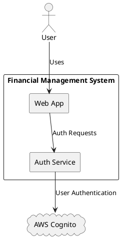
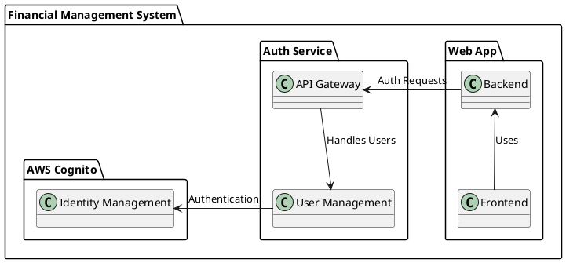
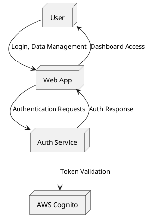
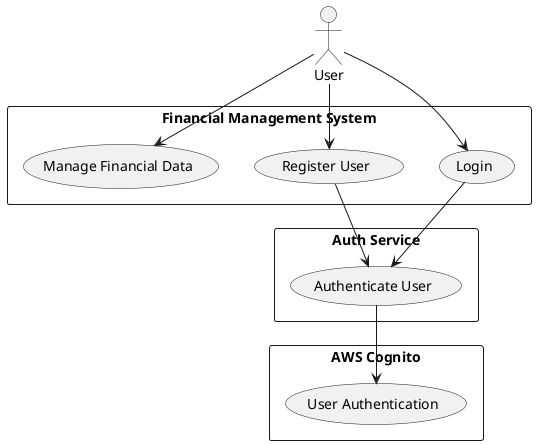
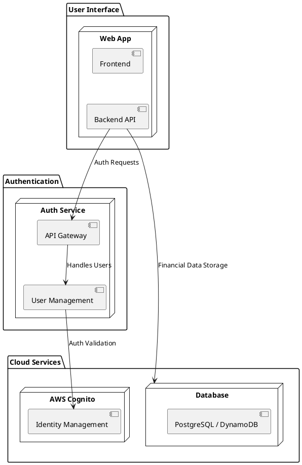
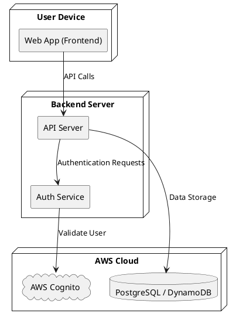

# Carrot Stack - System Specification document

## 1. Introduction
The **Financial Management System** aims to provide users with an easy-to-use platform for managing financial data. The system includes a **Web App**, an **Authentication Service**, and **AWS Cognito** as the authentication backend. This document outlines the architecture, requirements, and implementation plan.

## 2. System Overview
### 2.1 System Context Diagram
The system consists of multiple components interacting seamlessly to provide authentication and data management features. Below is a high-level representation of the system:

## 3. System Decomposition
### 3.1 Block Definition Diagram (BDD)
The following diagram breaks down the system into its core components:

## 4. Internal Structure
### 4.1 Internal Block Diagram (IBD)
This diagram details the internal interactions within the system:

## 5. Use Cases
### 5.1 Use Case Diagram
The following diagram represents the primary user interactions:

---

# Next Steps

## 6. Requirements Definition & Refinement
The system must satisfy the following requirements:
- **Functional Requirements:**
  - Users can register, log in, and reset passwords.
  - Users can manage financial records securely.
  - The system must allow role-based access control.
- **Non-Functional Requirements:**
  - The system must scale to support thousands of concurrent users.
  - Data must be encrypted in transit and at rest.
  - Authentication must comply with OAuth2 security best practices.

## 7. Architecture & Detailed Design
- **Technology Stack:**
  - Web App: React.js / Next.js
  - Authentication Service: Node.js / FastAPI
  - Database: PostgreSQL / DynamoDB
- **Authentication Flow:**
  - Users authenticate via AWS Cognito using OAuth2.
  - JWT tokens validate session identity.
  - Role-based access controls define system permissions.

### 7.1 High-Level Architecture
The following diagram outlines the architecture of the system:

### 7.2 Deployment Diagram
This diagram illustrates how the system is deployed:

## 8. Implementation Plan
- **Phase 1:**
  - Set up **AWS Cognito** user pools and authentication flows.
  - Implement **Auth Service** to handle user sessions.
- **Phase 2:**
  - Develop **Web App** with authentication and data management features.
  - Configure API endpoints for CRUD operations on financial data.
- **Phase 3:**
  - Implement logging and monitoring with AWS CloudWatch.
  - Perform initial security audits and compliance checks.

## 9. Testing Strategy
- **Unit Testing:**
  - Individual components (Auth Service, Web App UI, API endpoints).
- **Integration Testing:**
  - Authentication workflows and role-based access control.
- **Security Testing:**
  - Penetration testing and vulnerability assessments.
- **Performance Testing:**
  - Load testing to ensure AWS Cognito can handle concurrent users.

## 10. Deployment & DevOps
- **Continuous Integration & Deployment (CI/CD):**
  - Implement GitLab CI/CD pipelines for automated deployment.
- **Infrastructure as Code (IaC):**
  - Use Terraform or CloudFormation for AWS resource provisioning.
- **Monitoring & Logging:**
  - Deploy AWS CloudWatch for real-time monitoring and alerts.

## 11. Validation & Iteration
- **User Acceptance Testing (UAT):**
  - Ensure the system meets business and user requirements.
- **Feedback & Enhancements:**
  - Collect user feedback and refine features.
- **Ongoing Maintenance:**
  - Continuously monitor performance and security updates.

---

# Conclusion
This document provides a structured overview of the **Financial Management System**, including system design, requirements, and an implementation roadmap. The next steps involve refining requirements, setting up the architecture, and beginning development.

## Base Features

- AWS configuration for ...
  - authentication with cognito
  - API Gateway for API endpoints
  - Lambda function for API backend functions
  - database backend (DynamoDB)
- API backend library implementing the core functionality for the API backend
- Lambda function to handle API requests (using the API backend library)
- Finance app to manage financial data as demo application

## Structure

    /carrot
    ├── packages
    │   ├── frontend (React - typescript)
    │   ├── backend (Express - typescript)
    │   ├── cdk (AWS Infrastructure - typescript)

## TODOs

- [ ] Auth-app hosting via cdk
- [ ] Language support for auth-app
- [ ] Self-register and data change auth-app